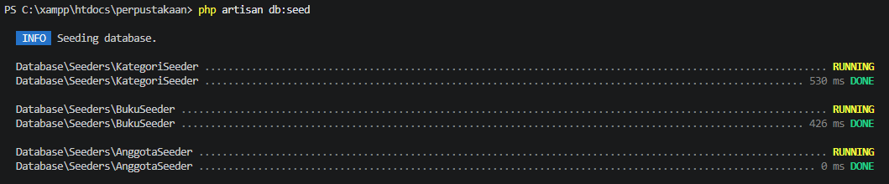
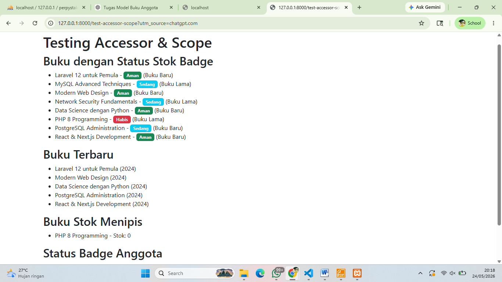

# Tugas 10 - Pemrograman Web II

## Identitas
- **Nama:** M. Hamdan Aldiansyah
- **Mata Kuliah:** Pemrograman Web II
- **Tugas:** Pertemuan 10

---

## Deskripsi Tugas

Implementasi accessor dan scope pada model:

### Model Buku
Accessor:
- status_stok_badge
- tahun_label

Scope:
- stokMenipis()
- hargaRange($min, $max)
- terbaru()

### Model Anggota
Accessor:
- status_badge
- kategori_usia

Scope:
- jenisKelamin($jk)
- terdaftarBulanIni()

---

## Route Testing

Route yang digunakan:

- `/buku`
- `/anggota`
- `/test-query`
- `/test-accessor-scope`

---

## Screenshot Hasil Migration


---

## Screenshot Hasil Seeder



---

## Screenshot Testing Route



---

## Teknologi yang Digunakan

- PHP
- Laravel 12
- MySQL
- Bootstrap

---

## Cara Menjalankan Project

```bash
php artisan migrate
php artisan db:seed
php artisan serve